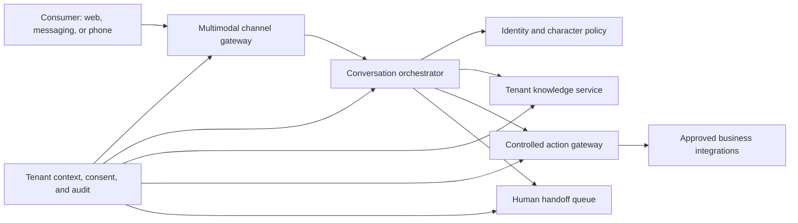

# Reviva AI Employee Product Framework

Version: 1.0

Status: Active

Owner: Reviva Product and Engineering

---

## Purpose

This document defines the product and delivery framework for Reviva as an AI
Employee. Reviva is not a chatbot with a different label. It is a bounded,
auditable digital worker with a consistent identity that can listen, speak,
reason within approved business context, perform controlled actions, and
involve a person when human judgment is required.

The first Reviva role is an AI Front Desk Employee for med spas. REVOS is the
reusable operating system that will support the role.

## AI Employee Capability Model

Reviva becomes usable only when these capabilities work together:

1. **Identity and character** — a documented role, tone, vocabulary, limits,
   disclosure behavior, and escalation style that remain consistent across
   channels.
2. **Conversation** — contextual, multi-turn communication that understands
   intent instead of matching isolated keywords.
3. **Voice** — real-time listening and speaking with interruption handling,
   turn-taking, latency targets, and a clearly disclosed AI identity.
4. **Knowledge** — tenant-approved services, policies, hours, locations,
   pricing rules, and frequently asked questions with source traceability.
5. **Actions** — controlled tools for tasks such as checking availability,
   creating a lead, requesting a booking, or escalating a conversation.
6. **Memory** — scoped conversation context and approved customer context with
   explicit retention rules. Memory must never cross tenant boundaries.
7. **Human collaboration** — clear handoff triggers, conversation summaries,
   operator ownership, and a route back to the AI Employee when appropriate.
8. **Governance** — consent, audit logs, access control, quality evaluation,
   incident response, and configurable business and safety boundaries.

Character means a reliable professional identity, not a fabricated human
identity. Reviva must disclose that it is an AI assistant and must not claim
feelings, credentials, or actions it does not have.

## Product Runtime

The model never receives direct database access. Business actions pass through
typed, authorized, tenant-aware application boundaries and produce audit
events.

## Delivery Workflow

Each phase has an entry condition, an output, and an exit gate. Work may be
prototyped ahead, but a phase is complete only when its exit gate has evidence.

### Phase 0 — Product contract

Define the first customer profile, the front desk job, supported channels,
success measures, character contract, safety boundaries, and launch claims.

Exit gate:

- the first role and excluded work are documented;
- representative patient journeys and escalation scenarios are approved;
- every public claim maps to current evidence or is labeled as a product vision.

### Phase 1 — Publishable public experience

Deliver the brand system, accessible landing page, product metadata, lead
capture path, legal pages, analytics consent, deployment, domain, and basic
monitoring.

Exit gate:

- a prospect can understand Reviva and submit interest successfully;
- the deployed site passes accessibility, performance, security header, and
  cross-browser checks;
- lead delivery and operational ownership are tested end to end.

### Phase 2 — Tenant and knowledge foundation

Create tenant onboarding, organization and location configuration, role-based
access, knowledge ingestion, source review, publishing, versioning, and audit.

Exit gate:

- two test tenants remain isolated under automated tests;
- an operator can publish and roll back approved knowledge;
- every generated business answer can identify the knowledge version used.

### Phase 3 — Conversational core

Build the text-first conversation orchestrator, intent handling, session state,
tool selection, refusal behavior, evaluation fixtures, and observable traces.

Exit gate:

- priority journeys pass deterministic and model-based evaluations;
- unsupported, medical, urgent, and ambiguous requests route safely;
- latency, cost, failure, and escalation metrics are observable.

### Phase 4 — Voice and character runtime

Add streaming speech input, speech output, interruption handling, turn-taking,
channel disclosure, voice configuration, pronunciation rules, and character
consistency evaluations. Begin with a controlled web voice experience before
adding telephony unless customer validation requires a different order.

Exit gate:

- users can start, interrupt, resume, and end a voice conversation;
- AI disclosure and recording consent behavior are approved for the launch
  market and channel;
- voice latency and intelligibility meet documented targets on supported
  devices and network conditions;
- text and voice produce equivalent policy and escalation behavior.

### Phase 5 — Controlled business actions

Introduce actions one at a time: create or update a lead, check appointment
availability, request a booking, send a confirmation, and notify an operator.

Exit gate:

- every action is schema-validated, authorized, idempotent where required, and
  auditable;
- destructive or consequential actions require the appropriate confirmation;
- integration failures degrade safely without inventing success.

### Phase 6 — Human operations

Deliver the operator inbox, conversation timeline, summary, assignment,
handoff, takeover, resolution, quality review, and customer feedback workflow.

Exit gate:

- a human can take ownership without losing conversation context;
- response and escalation ownership are explicit;
- operators can identify and report an unsafe or incorrect interaction.

### Phase 7 — Pilot readiness

Run internal simulations, red-team scenarios, a controlled design-partner
pilot, incident drills, data recovery tests, and a support runbook.

Exit gate:

- pilot customers sign off on configured knowledge and escalation rules;
- critical journeys meet agreed quality and reliability thresholds;
- launch, rollback, support, and incident owners are named.

### Phase 8 — Production launch

Release through a staged rollout with monitoring, feedback review, weekly
quality evaluation, and controlled expansion of tenants, channels, and actions.

Exit gate:

- production service objectives and alerts are active;
- no unresolved launch-blocking security, privacy, accessibility, or safety
  findings remain;
- the team can stop, roll back, or disable an unsafe channel or action.

## Non-Negotiable Safety Boundaries

- Reviva does not diagnose, prescribe, or represent itself as a medical
  professional.
- Urgent or emergency language must trigger approved guidance and human
  escalation rather than an improvised medical response.
- Voice recording, transcription, consent, retention, and deletion behavior
  require market-specific legal and privacy review before launch.
- Reviva must state when it is an AI and must not impersonate a real employee.
- Tenant data, knowledge, credentials, and conversation context remain isolated.
- The model cannot directly access databases or third-party systems.
- A failed action must never be presented to the customer as successful.
- Human takeover and channel shutdown must remain available during incidents.

## Definition of Done for Any Capability

A capability is complete only when:

- the user journey and excluded behavior are documented;
- the implementation has tenant, authorization, failure, and audit boundaries;
- automated tests and representative evaluations pass;
- accessibility and supported-device behavior are verified where applicable;
- privacy, security, safety, and operational ownership are reviewed;
- monitoring and rollback behavior exist;
- documentation and the launch checklist contain evidence.
