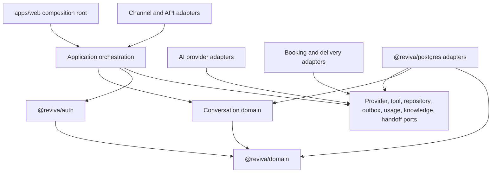
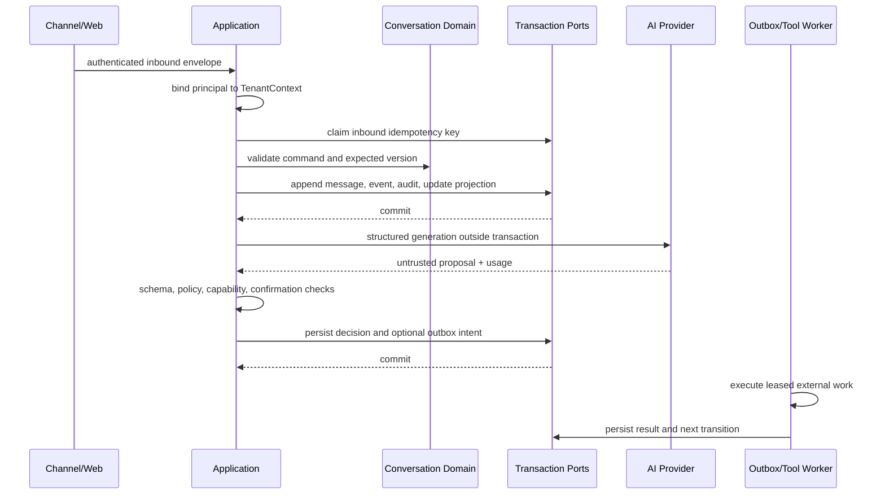

# Reviva Conversational Core Architecture

Status: REV-011A Complete — accepted architecture contract

Last reviewed: 2026-07-18

## Purpose

This document defines implementation boundaries for Emma, Reviva's AI Booking
and Reactivation Agent. It is a design contract, not a runtime implementation.

## Baseline

REV-001 through REV-010 provide a Next.js composition root, dependency-free
tenant and knowledge domain, server-validated Supabase identity, trusted
`TenantContext`, restricted PostgreSQL transactions, forced RLS, immutable
knowledge versions, append-only audit events, and expected-version persistence
for selected writes. Current authorization proves tenant membership but does
not yet provide command-specific capabilities. Current audit reads are
unbounded. No conversation, provider, tool, outbox, or streaming runtime exists.

## Normative Principles

1. Model output MUST be treated as untrusted input.
2. AI MUST NOT receive repositories or database credentials.
3. Tool execution MUST occur server-side through a closed registry.
4. Every mutation MUST pass deterministic authorization.
5. `TenantContext` MUST be derived from a server-validated principal; browser,
   model, channel, and provider claims MUST NOT establish authority.
6. Tenant access, capability, tool policy, confirmation, and human approval are
   separate decisions; one MUST NOT imply another.
7. Provider and external-service calls MUST NOT run inside long-lived database
   transactions.
8. Side effects MUST use scoped idempotency and at-least-once-safe handlers.
9. Messages, decisions, and events MUST be append-oriented and auditable.
10. Provider-specific types MUST remain inside provider adapters.
11. Prompts, policies, output schemas, model configuration, tenant
    configuration, and tool registries MUST be versioned.
12. Structured output MUST pass syntactic and semantic validation.
13. Human handoff MUST be a first-class state and ownership boundary.
14. Usage, cost, latency, retries, and cancellation MUST be measurable.
15. Failures MUST be typed, classifiable, recoverable where safe, and redacted.
16. Knowledge citations MUST retain published-version provenance.
17. State transitions MUST be deterministic outside the model.
18. Model text, retrieved content, and tool output MUST NOT grant permission or
    override higher policy.

## Target Dependency Graph

Dependency arrows point toward owned contracts. Domain code MUST NOT import
Next.js, React, Supabase, PostgreSQL, provider SDKs, channel SDKs, or booking
SDKs. Adapters MUST NOT place vendor objects in domain events.

## Package and Layer Architecture

Package proliferation is intentionally limited.

| Architecture unit | Responsibility | Allowed dependencies | Forbidden dependencies | Public API | Tests |
| --- | --- | --- | --- | --- | --- |
| `@reviva/conversation` | Aggregate, state machine, commands, events, failures, capabilities | `@reviva/domain` types only | Web, database, provider SDKs | Pure types/functions and ports owned by conversation domain | Deterministic unit/property tests |
| `@reviva/application` | Command orchestration, policy ordering, idempotency workflow, provider/tool coordination | conversation, auth, domain | Next.js and concrete vendors | Use-case handlers and port bundles | Orchestration/contract tests |
| Existing `@reviva/postgres` | Implements conversation, event, outbox, usage, and audit ports | domain contracts, PostgreSQL driver | Provider/channel SDKs | Infrastructure adapters only | Hosted integration/concurrency tests |
| `apps/web` | HTTP/auth composition, streaming delivery, server-only wiring | application and adapters | Core business rules | Route/server-action boundary | Authenticated route E2E |
| Provider/tool adapters | Translate external protocols into Reviva contracts | application ports and vendor SDK | Domain rule ownership | Adapter implementations | Contract and sandbox tests |

`@reviva/ai` and `@reviva/tools` SHOULD NOT be created initially. Their ports
belong in `@reviva/application`; separate packages are justified only after a
second provider or independently deployed tool family creates a real boundary.

## Conversation Aggregate

The aggregate coordinates mutable conversation control state. Immutable
messages and events are separate append streams referenced by the aggregate.

| Field | Semantics | Consistency |
| --- | --- | --- |
| Conversation ID | Stable opaque identifier | Aggregate |
| Tenant and location | Mandatory ownership and policy scope | Aggregate, immutable |
| Channel | Web, SMS, voice, or supported channel identity | Aggregate, immutable per conversation |
| Status | Deterministic top-level state | Aggregate versioned |
| Current owner | AI, human operator, or unassigned | Aggregate versioned |
| Handoff state | Reason, urgency, queue, assignee, timestamps | Aggregate versioned |
| Booking/reactivation intent | Progress and required-field status, not external records | Aggregate versioned |
| Contact reference | Internal opaque reference; no raw clinical data requirement | Aggregate |
| Participants | References plus actor category and channel identity | Aggregate membership |
| Version | Incremented for every accepted command | Aggregate |
| Timestamps/closure reason | Lifecycle evidence | Aggregate |

Messages MUST be immutable. Corrections, redactions, delivery changes, and
operator notes MUST append new records that reference the original. Mutable
conversation metadata MAY be updated only by valid expected-version commands.
State is stored as a current projection and also reconstructable from accepted
events. The projection is authoritative for command processing; events are
authoritative evidence for replay and debugging.

Each message envelope records conversation, tenant, channel, immutable channel
message ID when available, author actor category/reference, direction
(`inbound`, `outbound`, or `internal`), content reference, source/received/
accepted timestamps, aggregate sequence, correlation and idempotency IDs,
delivery state references, citations, and schema/content-policy version. A
participant is an aggregate membership reference; message authorship is
recorded per immutable message and MUST NOT be inferred from display text.

The aggregate MUST transactionally contain status, owner, handoff state,
intent-progress summary, version, and the event that caused each change.
Message delivery, provider usage settlement, external booking completion, and
analytics MAY be eventually consistent through correlated events/outbox work.

## Port Inventory

The application layer owns these vendor-independent ports:

- `ConversationRepository`: load aggregate and save with expected version.
- `ConversationEventRepository`: append immutable ordered events.
- `MessageRepository`: append immutable inbound/outbound records and retrieve
  cursor-paginated history.
- `AuditPort`: append security/business decisions; cursor-paginated reads.
- `OutboxPort`: claim, lease, complete, retry, or dead-letter side-effect work.
- `AIProviderPort`: structured generation, optional streaming, cancellation,
  usage and provider metadata.
- `ToolRegistry`: resolve an allowlisted tool by Reviva ID and version.
- `ToolAuthorizationPort`: evaluate capabilities and contextual policy.
- `KnowledgeRetrievalPort`: return published, tenant/location-filtered evidence.
- `UsageLedgerPort`: reserve and settle tenant/conversation budget usage.
- `HandoffPort`: queue and assignment integration without owning domain state.

## Request and Command Flow

## Knowledge and Provenance

Retrieval MUST use published knowledge versions, current tenant scope, and
applicable location scope. Every returned item MUST include entry/version IDs,
source kind, source locator when available, publication/verification time, and
a retrieval snapshot/correlation ID. Assistant messages that rely on knowledge
MUST store the references used.

Retrieved text is untrusted content. It MUST be delimited from system policy,
MUST NOT define tools or permissions, and MUST NOT override safety rules. If
evidence is absent, stale beyond tenant policy, conflicting, or low confidence,
Emma MUST ask a clarifying question, provide a bounded no-answer, or request
handoff rather than invent an answer. A later knowledge rollback does not alter
historical citations; new turns use the new published version.

## Usage, Audit, and Retention Boundary

- Audit records contain authorization, state, tool, handoff, and security
  decisions, not message bodies or hidden reasoning.
- Operational logs contain redacted correlation, latency, retry, and health
  data with short operational retention.
- Metrics contain aggregate counters/histograms without message content.
- Usage ledger records provider units, estimated cost, tenant/conversation
  budgets, model/config versions, and settlement status.
- Billing records, if introduced, derive from settled usage and are separate
  from security audit.
- Audit and message queries MUST be cursor-paginated by tenant plus stable
  `(occurredAt, id)` ordering; unbounded list APIs are forbidden.
- Retention classes MUST distinguish security/compliance evidence, operational
  telemetry, message content, and billing evidence. Durations require CTO/legal
  approval. Archival MUST preserve tenant scope, integrity metadata, deletion
  holds, and restore tests.

Expected high-volume categories are messages, provider interactions, delivery
attempts, tool lifecycle events, token/usage settlements, and state transitions.

## Decision Log

| Decision | Alternatives | Reason | Tradeoff/consequence | Follow-up |
| --- | --- | --- | --- | --- |
| Pure conversation domain plus application orchestrator | Put logic in web or provider adapter | Keeps transitions deterministic/vendor-independent | Two explicit layers and more ports | REV-011B/C |
| Projection plus immutable event/message streams | Mutable chat rows; full event sourcing only | Fast commands plus replayable evidence | Projection/event consistency must be transactional | REV-011D |
| Closed versioned tool registry | Arbitrary function calling | Prevents model-selected code execution | Registry governance required | REV-011C |
| Optimistic versioning plus short per-command transaction | Last-write-wins; permanent worker lock | Fits serverless and exposes races | Conflicts require deterministic retry/re-evaluation | REV-011B/D |
| Transactional outbox for external effects | Call external APIs in transaction | Avoids locks and supports recovery | At-least-once delivery and dedupe required | REV-011D |
| Reviva-owned structured provider contract | Provider-native objects in domain | Enables testing and provider changes | Translation adapters add work | REV-011E |

## Accepted Architecture Policy

| Area | Mandatory policy |
| --- | --- |
| Booking creation | Emma MUST receive explicit patient confirmation for a complete booking summary before an idempotent `booking.create` may be authorized. |
| Appointment modification | Every material change MUST receive fresh patient confirmation; the change invalidates prior confirmation. |
| Appointment cancellation | Autonomous `booking.cancel` is PROHIBITED in the initial release. Emma MAY prepare a request, but human approval is REQUIRED. |
| Tenant authority | Tenant and location administrators MAY narrow authority but MUST NOT expand it beyond Reviva's global maximum. |
| Structured-output repair | Invalid structured output permits at most one repair attempt; a second failure MUST produce `InvalidModelOutput` and safe fallback or handoff. |
| Provider retry | A retryable provider failure permits at most two retries after the initial request. Authorization, state, confirmation, policy, and non-retryable failures MUST NOT be retried automatically. |
| External uncertainty | An uncertain external mutation MUST enter reconciliation and MUST NOT be blindly retried. |
| Cost ceilings | Per-conversation and per-tenant rolling cost ceilings are REQUIRED; reaching either ceiling MUST stop autonomous provider execution safely and be audited. |
| Handoff SLA | Provisional defaults are four business hours for Normal, one business hour for High, and immediate queue escalation for Urgent or safety-sensitive work. They are operational targets, not patient promises. |
| Retention | Configurable retention, archival, legal hold, redaction/tombstone semantics, and separate content/audit/telemetry/usage classes are REQUIRED. Exact durations remain pending legal/privacy approval. |
| Reactivation | A validated communication basis is REQUIRED, only one active sequence per contact is allowed, and explicit opt-out MUST immediately and irreversibly stop autonomous outreach in the active workflow. |
| AI configuration | Safety and authorization remain deterministic. Low-variance intent/tool planning and bounded informational wording are architecture defaults; provider, model, and exact settings remain pending evaluation. |

Effective AI authority is the intersection of the global Reviva maximum,
subscription capability, tenant policy, location policy, conversation state,
explicit delegation, tool policy, and required confirmation or human approval.
No lower layer may widen a higher-layer restriction.

## Pending Decisions by Classification

### Pending implementation configuration

- Actual monetary values and rolling windows for mandatory cost ceilings.
- Retry backoff and timeout durations within the accepted retry limits.
- Tenant queue routing, after-hours routing, and SLA escalation mechanics.
- Channel-specific patient/contact identity binding and merge rules.
- Queue/worker technology and measured serialization strategy.
- Projection rebuild cadence and archive/partition thresholds.

### Pending provider evaluation

- Provider, model, fallback behavior, and exact generation settings.
- Provider-specific usage accounting and sandbox evidence.

### Pending legal/privacy approval

- Exact retention durations and legal-hold operating procedures.

### Deferred product capability

- Autonomous appointment cancellation. Reconsideration requires hosted
  verification, operational evidence, and a new approved policy decision.

## Explicit Non-goals

REV-011A does not create runtime packages, database tables, migrations, queues,
provider configuration, tool execution, booking integration, background jobs,
streaming endpoints, or chat UI. It does not select a model or approve exact
retention durations.
