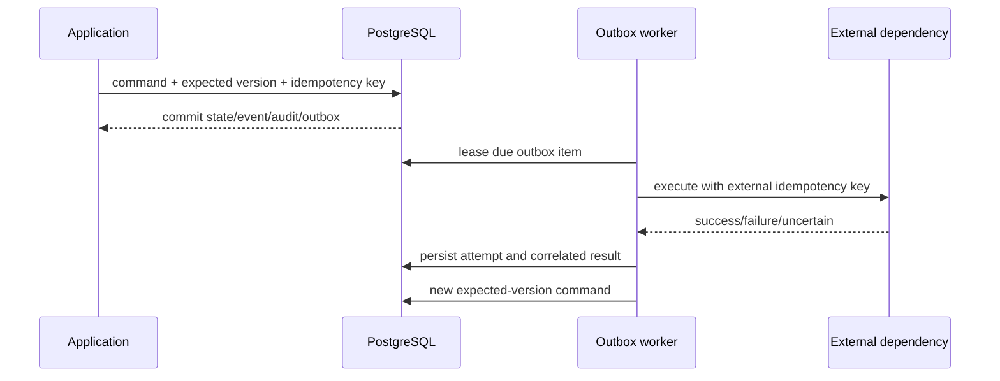

# Transaction, Outbox, and Idempotency Contract

Status: REV-011A Complete — accepted architecture contract resolving AUD-014

## Concurrency Decision

Use a hybrid model:

- optimistic concurrency with mandatory `expectedVersion` for every
  conversation command;
- one short database transaction per accepted command or correlated result;
- transactional outbox for external work;
- worker leasing for outbox execution;
- optional per-conversation queue as an optimization, never the correctness
  boundary.

Last-write-wins is forbidden. A permanent advisory lock or long-lived
per-conversation worker is not recommended for serverless delivery. Advisory
locks MAY be used only inside a short transaction for a measured contention
case and MUST NOT replace expected-version semantics.

## Atomic Command Transaction

The following MUST occur together:

1. claim scoped idempotency key;
2. load aggregate and verify expected version;
3. validate state command and principal binding;
4. evaluate and persist authorization decision;
5. append inbound message/event where applicable;
6. update conversation projection and increment version;
7. append audit evidence;
8. create outbox intent for external work, if any;
9. commit or roll back all records.

The transaction MUST NOT contain a model call, booking/calendar request,
SMS/email/webhook call, stream delivery, retry delay, or operator wait.

## External Flow



## Idempotency Keys

| Source | Key source | Scope |
| --- | --- | --- |
| Inbound channel message | Channel account + immutable channel message ID | Tenant, channel, conversation |
| Web/API command | Server-generated/request header key after authentication | Tenant, principal, command type |
| Model interaction | Conversation ID + aggregate version + turn purpose + policy bundle version | Tenant, conversation |
| Tool proposal | Conversation version + tool ID/version + normalized effect digest | Tenant, conversation, tool |
| External execution | Stable outbox/effect ID, propagated when provider supports it | Tenant, adapter, effect |
| Delivery attempt | Message ID + channel + recipient reference + content version | Tenant, delivery channel |

Keys MUST NOT contain secrets, raw patient data, or mutable display values.
Duplicate completed requests return the stored safe outcome. Duplicate in-flight
requests return an in-progress handle. A duplicate with the same key but a
different normalized request digest is a `DuplicateRequest` conflict.

## Outbox Lifecycle

```text
Pending → Leased → Succeeded
                 ↘ RetryScheduled → Leased
                 ↘ ReconciliationRequired
                 ↘ DeadLettered
```

An outbox record includes tenant, conversation, effect ID, tool/adapter and
version, safe normalized payload reference, idempotency key, correlation ID,
attempt count, due time, lease owner/expiry, policy versions, result reference,
and terminal reason. Sensitive payloads require encryption/data minimization
and MUST NOT be copied into audit or logs.

Workers claim work with an atomic lease. Expired leases may be reclaimed.
Handlers MUST assume at-least-once execution. Success MUST be durable before
acknowledgment. Exactly-once delivery is an illusion unless the external system
offers a compatible idempotency contract; Reviva MUST instead provide dedupe,
reconciliation, and compensating/manual recovery.

## Retry and Dead-letter Policy

- Retry classification comes from Reviva-owned failure types, not raw vendor
  status strings.
- Read-only calls MAY use bounded exponential backoff with jitter.
- Mutation retry MUST reuse the same external idempotency/effect key.
- Unknown or uncertain external mutation outcomes MUST enter reconciliation and
  MUST NOT be blindly retried. Correlation and idempotency identifiers MUST be
  preserved until external state is known or manual recovery is required.
- Validation, authorization, policy, and confirmation failures are not
  retryable without new evidence.
- Poison messages move to dead letter after the versioned attempt policy is
  exhausted and create an operator-visible recovery task.
- Manual recovery records operator principal, reason, chosen action, and
  correlation; it MUST NOT edit historical attempts.

AI provider failures classified as retryable permit at most two retries after
the initial request. Read-only tool retry counts and all backoff schedules
remain pending implementation configuration. High-risk or uncertain mutations
MUST NOT be blindly retried and require reconciliation or manual recovery.

## Race Handling

| Race | Required result |
| --- | --- |
| Concurrent inbound messages | One command commits per version; losers reload and re-evaluate in channel order |
| Human reply while AI generates | Human command increments version; stale AI result is stored as discarded evidence or omitted, never sent |
| Tool result after state changes | Correlation and expected version fail; reconcile without applying stale transition |
| Confirmation after proposal changes | Effect digest/version mismatch; confirmation rejected as stale |
| Handoff accepted during AI work | Ownership/version change suppresses pending AI send/tool intents |
| Duplicate worker delivery | External and local idempotency return prior result |

Channel arrival time does not establish order. Accepted aggregate sequence is
the authoritative order. Original provider timestamps are retained as evidence
for clock-skew investigation.

## Recovery and Reconciliation

Every external effect MUST support one of:

- query-by-idempotency/effect ID;
- query-by-provider request ID plus stable business identifiers;
- deterministic compensation;
- human reconciliation.

Outbox and result records retain correlation to authorization decision,
confirmation/approval, conversation version, tool definition, audit event, and
provider response metadata. Recovery MUST revalidate current tenant, policy,
capability, and aggregate state before issuing a new effect.

## Non-goals

This document does not choose a queue product, define tables, start workers, or
promise exactly-once external behavior.
